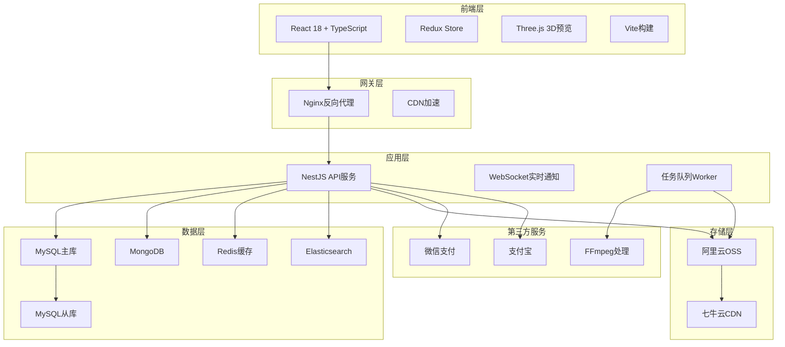

# 教程网盘资源共享平台 - 架构设计文档

## 1. 产品架构设计

### 1.1 整体架构图



### 1.2 核心模块依赖关系

```
用户模块 (User Module)
  ├── 认证服务 (Auth Service) - JWT + Redis会话
  ├── 权限服务 (Permission Service) - RBAC
  └── 存储配额服务 (Storage Quota Service)

资源模块 (Resource Module)
  ├── 上传服务 (Upload Service) - 分片上传 + OSS
  ├── 审核服务 (Review Service) - 工作流引擎
  ├── 预览服务 (Preview Service) - FFmpeg + 文档转换
  └── 分享服务 (Share Service) - 链接生成 + 权限验证

交易模块 (Transaction Module)
  ├── 订单服务 (Order Service) - 订单创建/支付
  ├── 支付服务 (Payment Service) - 微信/支付宝对接
  └── 提现服务 (Withdraw Service) - 创作者收益

搜索模块 (Search Module)
  ├── 索引服务 (Index Service) - Elasticsearch同步
  └── 检索服务 (Search Service) - 全文检索 + 推荐算法

统计模块 (Analytics Module)
  ├── 数据采集 (Data Collection) - 埋点 + 日志
  └── 报表服务 (Report Service) - 数据聚合 + 可视化
```

### 1.3 技术选型理由

| 技术 | 选型理由 |
|------|---------|
| **React 18** | 生态成熟、SSR支持、并发渲染提升性能 |
| **TypeScript** | 类型安全、IDE支持好、降低运行时错误 |
| **Redux** | 复杂状态管理、时间旅行调试、中间件生态 |
| **NestJS** | 模块化、依赖注入、装饰器语法、内置Swagger |
| **MySQL** | 事务支持、ACID保证、关系数据存储 |
| **MongoDB** | 非结构化数据、评论/日志存储、灵活schema |
| **Redis** | 高性能缓存、会话存储、分布式锁 |
| **Elasticsearch** | 全文检索、聚合分析、实时搜索 |
| **阿里云OSS** | 高可用、CDN集成、成本可控 |
| **七牛云CDN** | 视频加速、全球节点、带宽优化 |

## 2. 系统分层架构

### 2.1 表现层 (Presentation Layer)
- **React组件**: 可复用UI组件库
- **路由管理**: React Router v6
- **状态管理**: Redux Toolkit + RTK Query
- **UI框架**: Ant Design / Material-UI

### 2.2 业务逻辑层 (Business Logic Layer)
- **NestJS模块**: 按领域拆分（User/Resource/Transaction）
- **服务层**: 业务逻辑封装
- **DTO验证**: class-validator + class-transformer
- **异常处理**: 全局异常过滤器

### 2.3 数据访问层 (Data Access Layer)
- **ORM**: TypeORM (MySQL) + Mongoose (MongoDB)
- **查询优化**: 索引设计 + 查询缓存
- **事务管理**: 分布式事务（Seata/本地事务）

### 2.4 基础设施层 (Infrastructure Layer)
- **文件存储**: OSS SDK + 分片上传
- **消息队列**: Bull (Redis队列) - 异步任务处理
- **定时任务**: @nestjs/schedule - 数据同步/清理
- **监控日志**: Winston + Prometheus

## 3. 安全架构

### 3.1 认证授权
- **JWT Token**: Access Token (15min) + Refresh Token (7d)
- **Redis会话**: 存储用户状态、黑名单
- **RBAC权限**: 角色-权限-资源三级控制

### 3.2 数据安全
- **传输加密**: HTTPS/TLS 1.3
- **存储加密**: OSS服务端加密 + 敏感字段AES加密
- **SQL注入防护**: ORM参数化查询 + 输入验证
- **XSS防护**: React自动转义 + CSP头

### 3.3 业务安全
- **文件校验**: 格式白名单 + 病毒扫描（ClamAV）
- **敏感词过滤**: DFA算法 + 词库更新
- **防爬虫**: Rate Limiting + 验证码 + User-Agent检测
- **支付安全**: 签名验证 + 订单幂等性

## 4. 性能优化策略

### 4.1 前端优化
- **代码分割**: 路由懒加载 + 组件按需加载
- **资源优化**: 图片WebP、视频HLS/DASH
- **缓存策略**: Service Worker + HTTP缓存
- **CDN加速**: 静态资源全量CDN

### 4.2 后端优化
- **接口缓存**: Redis缓存热点数据（TTL策略）
- **数据库优化**: 读写分离 + 连接池 + 索引优化
- **异步处理**: 队列处理耗时任务（上传/转码）
- **负载均衡**: Nginx + 多实例部署

### 4.3 存储优化
- **OSS分层存储**: 热数据标准存储 + 冷数据归档
- **CDN缓存**: 视频/图片缓存策略
- **压缩传输**: Gzip/Brotli压缩

## 5. 可扩展性设计

### 5.1 水平扩展
- **无状态服务**: 支持多实例部署
- **数据库分库分表**: ShardingSphere
- **缓存集群**: Redis Cluster

### 5.2 垂直扩展
- **资源隔离**: Docker容器资源限制
- **队列优先级**: 高优先级任务优先处理
- **限流降级**: 熔断器 + 降级策略

## 6. 监控与运维

### 6.1 监控指标
- **应用监控**: APM (Application Performance Monitoring)
- **业务监控**: 订单量、下载量、用户活跃度
- **基础设施**: CPU/内存/磁盘/网络

### 6.2 日志管理
- **结构化日志**: JSON格式 + 日志级别
- **日志聚合**: ELK Stack (Elasticsearch + Logstash + Kibana)
- **告警机制**: 异常告警 + 阈值告警

## 7. 部署架构

### 7.1 开发环境
- **本地开发**: Docker Compose (MySQL + Redis + MongoDB)
- **热重载**: Vite HMR + NestJS Watch Mode

### 7.2 生产环境
- **容器化**: Docker + Kubernetes
- **CI/CD**: GitHub Actions / GitLab CI
- **蓝绿部署**: 零停机更新

---

**文档版本**: v1.0  
**最后更新**: 2025-12-10

